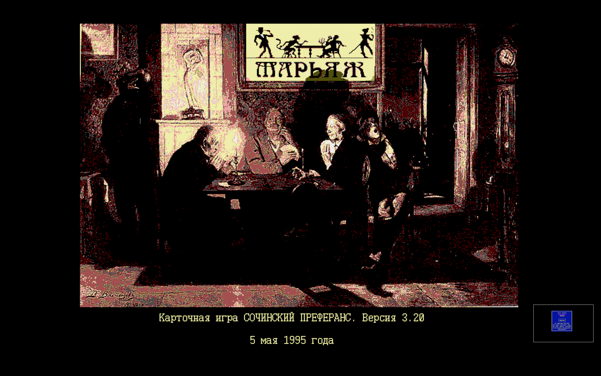
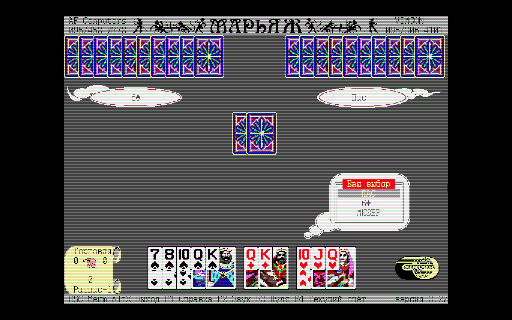
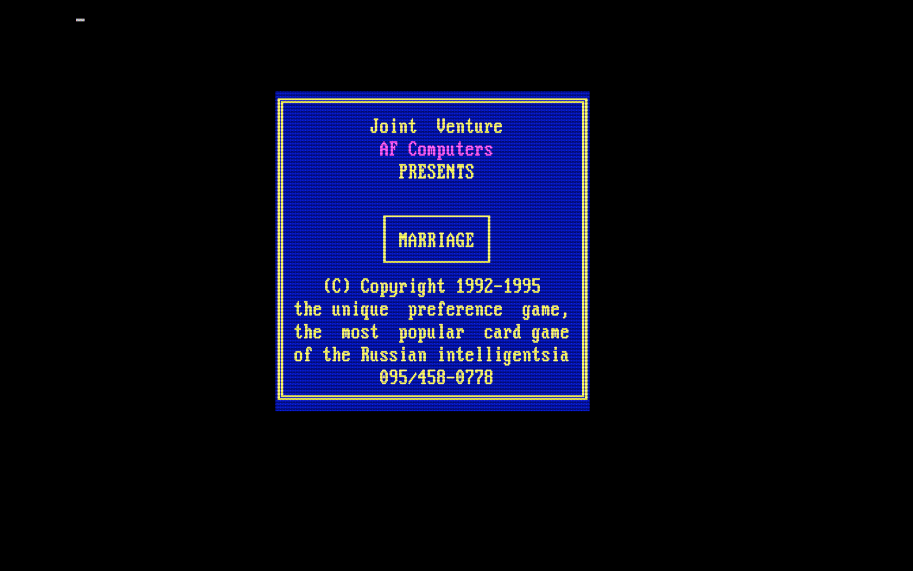

# 💍 МАРЬЯЖ (Marriage) — DOS-преферанс 3.20 (VIMCOM edition, nagfix)

Карточная DOS-игра **МАРЬЯЖ** — это цифровая версия сочинского преферанса от московской студии **AF Computers** (1992–1995).  
Данная сборка 3.20 создана по заказу фирмы **VIMCOM**, с разрешённым и поощряемым распространением.  
Оригинальный экран с предложением обращаться к разработчикам — удалён (nagfix).

**MARRIAGE** is a DOS card game — a digital version of Sochi-style preference developed by Moscow-based **AF Computers** (1992–1995).  
This 3.20 build was commissioned by **VIMCOM**, and distribution is explicitly allowed and encouraged.  
The original nag screen was removed.

---

## 📦 Особенности / Features

- Версия / Version: **3.20 (05.05.1995)**
- Язык / Language: **Русский / English**
- Тип игры / Game type: преферанс (соло, мизер, распас и др.)
- Автор / Author: **AF Computers**, Moscow
- Распространение / Distribution: разрешено
- Совместимость / Compatibility: macOS via **DOSBox Staging**

---

## 🖼 Скриншоты / Screenshots

  
  
  


---

## 🛠 Установка / Install (macOS)

```bash
/bin/bash -c "$(curl -fsSL https://raw.githubusercontent.com/MFRealG/dos-marriage/main/install.sh)"
```
